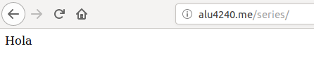
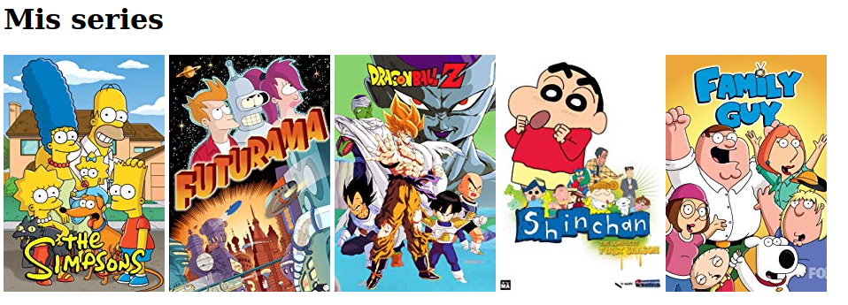

# UT1-A1: Mis series favoritas

## 1. Creación del dominio */series*
Para ello añadimos el archivo **alu4240** al directorio **sites-available** de la configuración de NGINX. Dentro del mismo añadimos lo siguiente:
```bash
server {
        server_name alu4240.me;

        location /series {
                root /home/alu4240/webapps;
        }
}
```

Después de ello haremos un enlace simbólico para que el subdominio se "active".
```bash
$> sudo ln -s ../sites-available/alu4240.me
```

Y finalmente usaremos el siguiente comando para que entre en funcionamiento.
```bash
$> sudo systemctl reload nginx
```

## 2. Creación de la estructura para la página web
Dentro de directorio **webapps** añadimos un directorio **series** donde le daremos forma a nuestra página web. La estructura será la siguiente.
```bash
.
├── img
│   ├── dbz.jpg
│   ├── fg.jpg
│   ├── futurama.jpg
│   ├── shichan.jpg
│   └── ts.jpg
└── index.html
```
Para comprobar que funciona dentro del fichero **index.html** escribimos algo de ejemplo.


Después de esto, copiaremos las carátulas de las series escogidas para la actividad, lo haremos por ssh.
```bash
$> scp Descargas/*.jpg alu4240@cloud:/home/alu4240/webapps/series/img
```

Finalmente editaremos el fichero **index.html** anteriormente creado, en él añadimos la infomación que se verá cuando accedamos a nuestra página web, en nuestro caso, añadimos lo siguiente por cada serie que queramos añadir.

Este es el que código que usaremos por defecto:
```bash
<a href="url_de_la_página"></a>
```

Y este es el que nosotros insertaremos con nuestras series en el archivo **index.html**:
```bash
<h1>Mis series</h1>
<a href="https://www.imdb.com/title/tt0096697/?ref_=nv_sr_1?ref_=nv_sr_1"></a>
<a href="https://www.imdb.com/title/tt0149460/?ref_=nv_sr_1?ref_=nv_sr_1"></a>
<a href="https://www.imdb.com/title/tt0214341/?ref_=nv_sr_1?ref_=nv_sr_1"></a>
<a href="https://www.imdb.com/title/tt0245612/?ref_=nv_sr_1?ref_=nv_sr_1"></a>
<a href="https://www.imdb.com/title/tt0182576/?ref_=nv_sr_1?ref_=nv_sr_1"></a>
```

## 3. Visualización de la página web
Al realizar todo lo anteriormente explicado tendremos el resultado de la página web con la carátula de nuestras series, que, al pinchar en ellas, nos llevará a la página web, este es su visualización.

