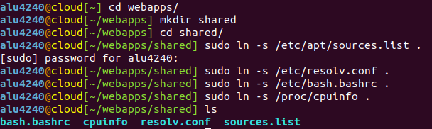
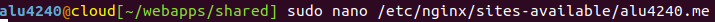
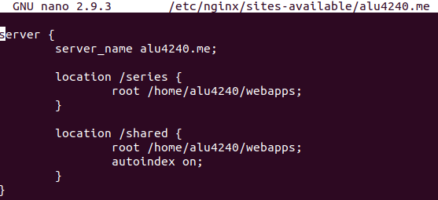
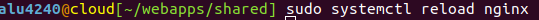
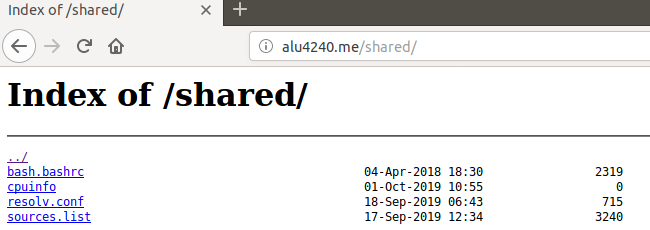

# UT1-A2: Listado de directorios

## 1. Creación del directorio **shared**

Para ello primero en nuestro home de usuario vamos al directorio **webapps**
y dentro de él creamos el directorio **shared**, después de esto, haremos los enlaces simbólicos de los siguientes ficheros dentro de este:
* `/etc/apt/sources.list`
* `/etc/resolv.conf`
* `/etc/bash.bashrc`
* `/proc/cpuinfo`

## 2. Activación de la ruta y recarga del servicio

Luego nos a la ruta `/etc/nginx/sites-available/` y añadimos el directorio que acabamos de crear al fichero `alu4240.me`.

Dentro del fichero añadimos lo siguiete:

Finalmente después de esto, recargamos el servicio **nginx** ya que no hace falta hacer enlace simbólico porque ya lo tenemos creado de la activdad anterior, usaremos el siguiente comando para reiniciarlo:

## 3. Resultado final

Como resultado al acceder a la página web **http://alu4240.me/shared/** nos saldrá el listado de ficheros creado al principio

