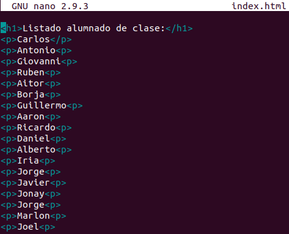

# UT1-A3: Trabajo con virtual hosts

## Sitio web 1
Tenemos que acceder a la página **http://imw.alu4240.me**, para ello vamos a `/etc/nginx/sites-available` y creamos el fichero **imw.alu4240.me**.


Ahora editamos el fichero y añadimos la información del dominio.


Luego creamos el enlace a `/etc/nginx/sites-enabled` para poner en funcionamiento la página.


Ahora pasamos a crear en `webapps` de nuestro **home** personal el esquema de ficheros.


Lo siguiente es descargar la imagen del diagrama de unidades que está en la **Moodle** de nuestro curso.


Movemos la imagen a la ruta `img`.


Recargamos el servicio de **Nginx** para que los cambios que hemos hecho se activen.


Como resultado veremos la página web con el diagrama.


Ahora tenemos que acceder a la página **http://imw.alu4240.me/mec** en la cual se tendría que ejecutar el PDF del BOE sobre nuestro ciclo, para ello nos movemos a la ruta  `/etc/nginx/sites-available` y modificamos el fichero **imw.alu4240.me** anteriormente creado.

Le tenemos que añadir lo siguiente:
```bash
location /mec {
        root /home/alu4240/webapps/imw;
}
```

Y quedará así:        


Ahora crearemos el fichero **index.html**, le tendremos que añadir la ruta al fichero pdf del BOE:
```bash
<a href="https://www.boe.es/boe/dias/2009/11/18/pdfs/BOE-A-2009-18355.pdf">Real decreto del título de Administración de Sistemas Informáticos en Red</a>
```

Esté es el resultado:


Ahora abrimos un explorador y accedemos a la URL antes mencionada y esto es lo que se debería ver:


## Sitio Web 2
Para el segundo sitio web tendremos que acceder a la página **http://varlib.alu4240.me:9000**, y se verá el listado de `/var/lib`.

Vamos a `/etc/nginx/sites-available` y creamos el fichero **varlib.alu4240.me**.


Ahora editaremos el fichero añadiendo lo siguiente:


Creamos el enlace en `/etc/nginx/sites-enabled` para que la página "funcione".


Creanos el enlace de los ficheros de `/var/lib` en `/webapps` y luego lo movemos a `/varlib` para que se vean en nustra página.                        


Aquí vemos el resultado en nuestra página.


## Sitio Web 3
Para este sitio web accederemos con **https://ssl.alu4240.me/students/** y como vemos, utilizaremos el protocolo seguro.

Primero crearemos el fichero **ssl.alu4240.me** en `/etc/nginx/sites-available`.


Luego haremos el enlace de dicho fichero en `/etc/nginx/sites-enabled`.


Lo siguiente será hacer en `/webapps` crear la la carpeta **ssl** y dentro de ella ootra que se llame **students**, y ahí crearemos nuestro **index.html** que llevará el nombre de nuestros compañeros de clase.



Ahora crearemos el certificado para nuestro protocolo seguro, para ello usaremos la herramiento **Certbot**, primero añadimos el repositorio donde descargaremos la herramienta.


Después de ello instalaremos la herrmaienta **Certbot**.


Ahora empezamos la creación del protocolo seguro:

```bash
alu4240@cloud[~] sudo certbot --nginx
Saving debug log to /var/log/letsencrypt/letsencrypt.log
Plugins selected: Authenticator nginx, Installer nginx
Enter email address (used for urgent renewal and security notices) (Enter 'c' to
cancel): grodriguez.inf@gmail.com

- - - - - - - - - - - - - - - - - - - - - - - - - - - - - - - - - - - - - - - -
Please read the Terms of Service at
https://letsencrypt.org/documents/LE-SA-v1.2-November-15-2017.pdf. You must
agree in order to register with the ACME server at
https://acme-v02.api.letsencrypt.org/directory
- - - - - - - - - - - - - - - - - - - - - - - - - - - - - - - - - - - - - - - -
(A)gree/(C)ancel: a

- - - - - - - - - - - - - - - - - - - - - - - - - - - - - - - - - - - - - - - -
Would you be willing to share your email address with the Electronic Frontier
Foundation, a founding partner of the Let's Encrypt project and the non-profit
organization that develops Certbot? We'd like to send you email about our work
encrypting the web, EFF news, campaigns, and ways to support digital freedom.
- - - - - - - - - - - - - - - - - - - - - - - - - - - - - - - - - - - - - - - -
(Y)es/(N)o: n

Which names would you like to activate HTTPS for?
- - - - - - - - - - - - - - - - - - - - - - - - - - - - - - - - - - - - - - - -
1: alu4240.me
2: hello.alu4240.me
3: imw.alu4240.me
4: ssl.alu4240.me
5: varlib.alu4240.me
- - - - - - - - - - - - - - - - - - - - - - - - - - - - - - - - - - - - - - - -
Select the appropriate numbers separated by commas and/or spaces, or leave input
blank to select all options shown (Enter 'c' to cancel): 4
Obtaining a new certificate
Performing the following challenges:
http-01 challenge for ssl.alu4240.me
Waiting for verification...
Cleaning up challenges
Deploying Certificate to VirtualHost /etc/nginx/sites-enabled/ssl.alu4240.me

Please choose whether or not to redirect HTTP traffic to HTTPS, removing HTTP access.
- - - - - - - - - - - - - - - - - - - - - - - - - - - - - - - - - - - - - - - -
1: No redirect - Make no further changes to the webserver configuration.
2: Redirect - Make all requests redirect to secure HTTPS access. Choose this for
new sites, or if you're confident your site works on HTTPS. You can undo this
change by editing your web server's configuration.
- - - - - - - - - - - - - - - - - - - - - - - - - - - - - - - - - - - - - - - -
Select the appropriate number [1-2] then [enter] (press 'c' to cancel): 2
Redirecting all traffic on port 80 to ssl in /etc/nginx/sites-enabled/ssl.alu4240.me

- - - - - - - - - - - - - - - - - - - - - - - - - - - - - - - - - - - - - - - -
Congratulations! You have successfully enabled https://ssl.alu4240.me

You should test your configuration at:
https://www.ssllabs.com/ssltest/analyze.html?d=ssl.alu4240.me
- - - - - - - - - - - - - - - - - - - - - - - - - - - - - - - - - - - - - - - -

IMPORTANT NOTES:
 - Congratulations! Your certificate and chain have been saved at:
   /etc/letsencrypt/live/ssl.alu4240.me/fullchain.pem
   Your key file has been saved at:
   /etc/letsencrypt/live/ssl.alu4240.me/privkey.pem
   Your cert will expire on 2020-01-06. To obtain a new or tweaked
   version of this certificate in the future, simply run certbot again
   with the "certonly" option. To non-interactively renew *all* of
   your certificates, run "certbot renew"
 - Your account credentials have been saved in your Certbot
   configuration directory at /etc/letsencrypt. You should make a
   secure backup of this folder now. This configuration directory will
   also contain certificates and private keys obtained by Certbot so
   making regular backups of this folder is ideal.
 - If you like Certbot, please consider supporting our work by:

   Donating to ISRG / Let's Encrypt:   https://letsencrypt.org/donate
   Donating to EFF:                    https://eff.org/donate-le
```

Ahora irémos a ver el archivo **ssl.alu4240.me** y veremos que el bot añadió unas líneas de configuración

```bash
server {
	server_name ssl.alu4240.me;
		root /home/alu4240/webapps/ssl/;

	location /students {
		root /home/alu4240/webapps/ssl;
		auth_basic "Acceso por contraseña";
		auth_basic_user_file /home/alu4240/webapps/ssl/students/.htpasswd;
	}


    listen 443 ssl; # managed by Certbot
    ssl_certificate /etc/letsencrypt/live/ssl.alu4240.me/fullchain.pem; # managed by Certbot
    ssl_certificate_key /etc/letsencrypt/live/ssl.alu4240.me/privkey.pem; # managed by Certbot
    include /etc/letsencrypt/options-ssl-nginx.conf; # managed by Certbot
    ssl_dhparam /etc/letsencrypt/ssl-dhparams.pem; # managed by Certbot

}
server {
    if ($host = ssl.alu4240.me) {
        return 301 https://$host$request_uri;
    } # managed by Certbot


	server_name ssl.alu4240.me;
    listen 80;
    return 404; # managed by Certbot

```

Este será el resultado:


Ahora añadiremos un usuario y contraseña a dicha página para que solo puedan conectar las personas que tengan dicho usuario y contraseña. Para ello tenemos que crear el archivo **.htpasswd**, en él añadimos una línea con el usuario y contraseña (cifrada).

Para cifrar la contraseña usaremos lo siguiente:


Ahora al archivo anteriormente creado le añadimos una línea para que nos bloquee el archivo **htpasswd**.


Entramos la página donde está el archivo **.htpasswd** y saldrá el error 403 que hemos configurado en el archivo.


## Sitio Web 4
Para acceder a este sitio web redigiremos las url **http://redirect.alu4240.me/test/**, **http://www.redirect.alu4240.me/probando/** y **http://www.redirect.alu4240.me/hola/** a la página **http://target.alu4240.me**.

Empezaremos creando el archivo **redirect.alu4240.me** en `/etc/nginx/sites-available`.


Luego le haremos el enlace a `/etc/nginx/sites-enabled`.


Ahora descargaremos un archivo .zip que hay donde habrá creado ya un **index.html** para nuestra página web.


Descomprimimos el contenido del fichero.


Creamos el archivo **target.alu4240.me** en `/etc/nginx/sites-available`.


Luego le haremos el enlace a `/etc/nginx/sites-enabled`.


Este es el conenido del archivo zip que nos descargamos


Por último creamos los ficheros **log**.


