# UT1-A4: Sirviendo aplicaciones Php y Python

## Sitio Web 1
Tenemos que acceder a la página **http://php.alu4240.me**, para ello vamos a `/etc/nginx/sites-available` y creamos el fichero **php.alu4240.me** con lo siguiente:

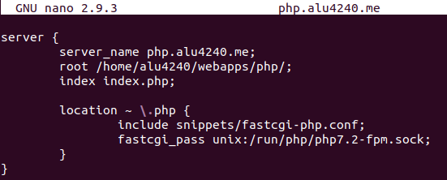

Ahora creamos el enlace del fichero anteriormente creado a `/etc/nginx/sites-enabled` para "activarla".

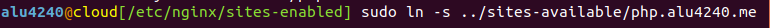

Creamos en nuestro home de usurio dentro de **webapps** la carpeta `php`, aquí dentro irán los ficheros que compondrán nuestra página.

Lo siguiente es descargar el archivo **demo_php.zip** que lo encontraremos en la práctica, después de descargarlo lo descomprimimos.

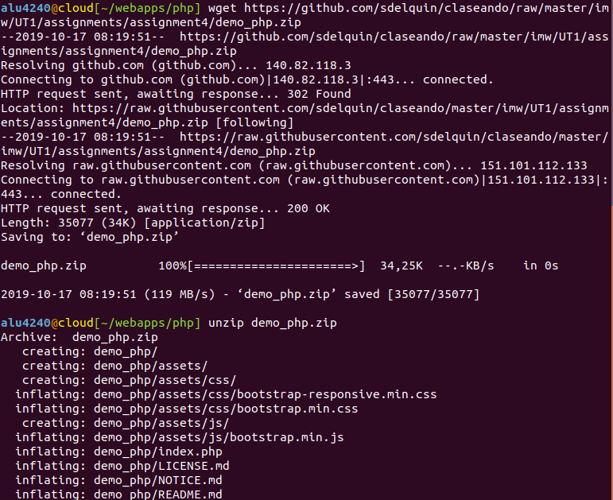

Este es el resultado que se mostrará en nuestra página al acceder.

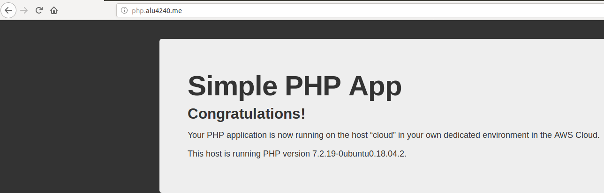

## Sitio Web 2
Para el segundo sitio web tendremos que acceder a la página **http://now.alu4240.me**, como anteriormente nos dirigimos a `/etc/nginx/sites-available`, creamos el fichero **now.alu4240.me** y le añadimos lo siguiente:

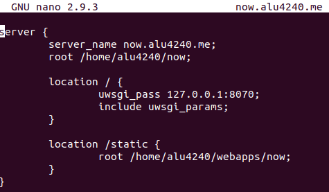

Creamos el enlace del fichero anteriormente creado a `/etc/nginx/sites-enabled` para "activarla".

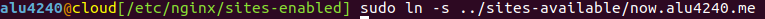

Vamos a nuestro home, dentro de **webapps**, creamos la carpeta `now`, dentro de esta lanzamos los siguiente para crear el entorno virtual que usaremos, primero instalamos **flask**.

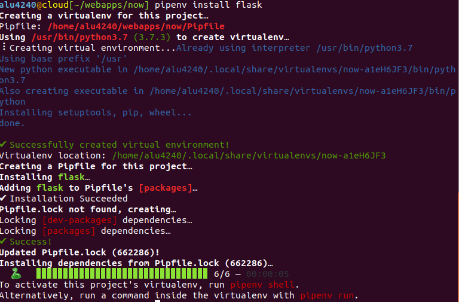

Y luego **pytz**.

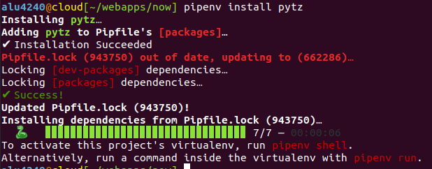

Creamos el fichero **main.py** que este nos monstrará el día y la hora de nuestra región geográfica.

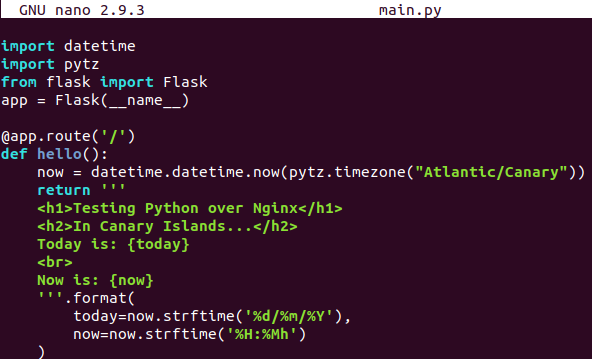

Ahora lanzaremos **uwsgi** para comprobar que lo hecho anteriormente funciona.

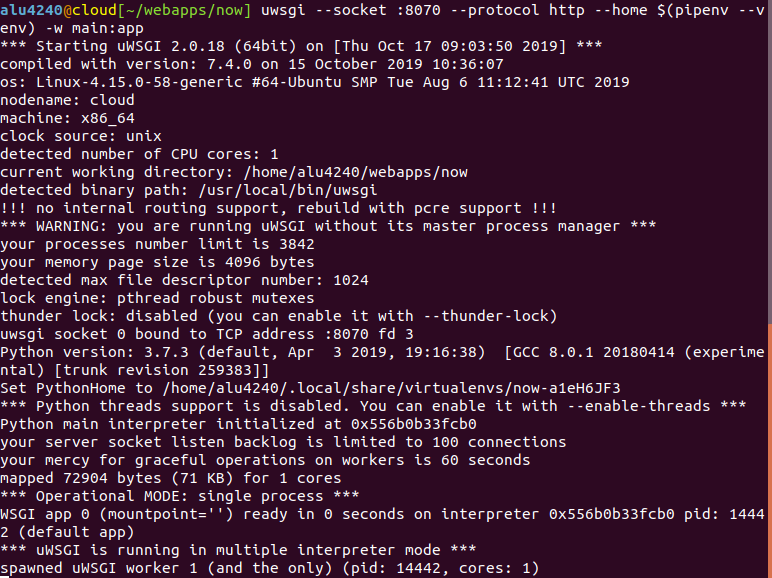

Como vemos funciona correctamente, pero lo que queremos es que lo hecho en el paso anterior se produzca automáticamente y no tener nosotros que lanzar el comando cada vez.

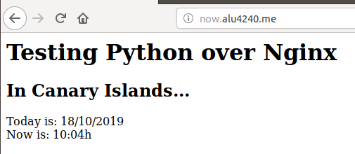

Para que se active automáticamente primero crearemos este script con lo siguiente:

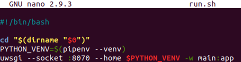

Le daremos permisos de ejecución al script que acabamos de crear.

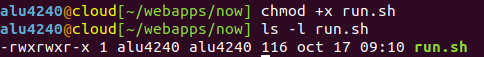

Usaremos **Supervisor** que es un servicio que hará lo que queremos.

Vamos a los ficheros de configuración personalizados en `/etc/supervisor/conf.d` y ahí creamos **now.conf**, dentro de él escribimos la configuración para lanzar el script creado anteriormente.

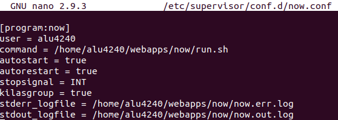

## Comprobaciones
Ahora comprobaremos lo que hace los siguientes comandos:

El siguiente comando nos muestra el estado de todas las configuraciones creadas en `/etc/supervisor/conf.d`

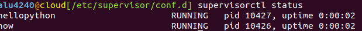

El siguiente comando para el fichero **now** que creamos anteriormente.

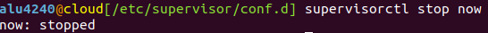

El siguiente comando inicia el fichero **now** que creamos anteriormente.

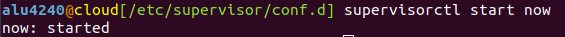

El siguiente comando reinicia el fichero **now** que creamos anteriormente.

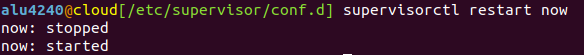
