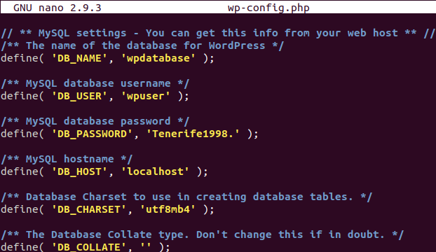

# UT4-A1: Implantación de Wordpress

## Instalación de Wordpress

### Creación de la base de datos
Lo primero que haremos es logearnos en mysql y crear una base de datos donde se crearán más tarde las tablas de Wordpress.


Luego crearemos el usuario que usará Wordpress para ello y le daremos permisos.


### Descarga de Wordpress
Ahora nos descargaremos la última version de Wordpress de su página web.


Y la copiaremos en la ruta **/usr/share** que es la que usaremos para alojar Wordpress.


Por último le daremos permisos al usuario **www-data** para que pueda usar los ficheros.


### Editar ficheros de configuración
Ahora haremos una copia del fichero **wp-config-sample.php**, que es el fichero de ejemplo, a **wp-config** que es el que usaremos para la instalación.


Ahora hay que modificar las siguientes líneas añadiendo los nombres de nuestra base de datos, nuestro usuario y la contraseña del usuario.


Lo siguiente que haremos es crear el fichero **wordpress.alu4240.me** en la ruta **/etc/nginx/sites-available**.


Por último crearemos el enlace simbólico en la ruta **/etc/sites-enabled** para que la web entre en funcionamiento y reiniciaremos el servicio.


### Creación certificado SSL
Ahora crearemos el certificado SSL para que nuestra página web sea segura, para ello lanzamoso lo siguiente en la consola y seguimos los pasos:

```console
alu4240@cloud[~] sudo certbot --nginx
Saving debug log to /var/log/letsencrypt/letsencrypt.log
Plugins selected: Authenticator nginx, Installer nginx

Which names would you like to activate HTTPS for?
- - - - - - - - - - - - - - - - - - - - - - - - - - - - - - - - - - - - - - - -
1: alu4240.me
2: hello.alu4240.me
3: hellopython.alu4240.me
4: imw.alu4240.me
5: now.alu4240.me
6: php.alu4240.me
7: redirect.alu4240.me
8: www.redirect.alu4240.me
9: ssl.alu4240.me
10: target.alu4240.me
11: varlib.alu4240.me
12: vm.alu4240.me
13: wordpress.alu4240.me
- - - - - - - - - - - - - - - - - - - - - - - - - - - - - - - - - - - - - - - -
Select the appropriate numbers separated by commas and/or spaces, or leave input
blank to select all options shown (Enter 'c' to cancel): 13
Obtaining a new certificate
Performing the following challenges:
http-01 challenge for wordpress.alu4240.me
Waiting for verification...
Cleaning up challenges
Deploying Certificate to VirtualHost /etc/nginx/sites-enabled/wordpress.alu4240.me

Please choose whether or not to redirect HTTP traffic to HTTPS, removing HTTP access.
- - - - - - - - - - - - - - - - - - - - - - - - - - - - - - - - - - - - - - - -
1: No redirect - Make no further changes to the webserver configuration.
2: Redirect - Make all requests redirect to secure HTTPS access. Choose this for
new sites, or if you're confident your site works on HTTPS. You can undo this
change by editing your web server's configuration.
- - - - - - - - - - - - - - - - - - - - - - - - - - - - - - - - - - - - - - - -
Select the appropriate number [1-2] then [enter] (press 'c' to cancel): 2
Redirecting all traffic on port 80 to ssl in /etc/nginx/sites-enabled/wordpress.alu4240.me

- - - - - - - - - - - - - - - - - - - - - - - - - - - - - - - - - - - - - - - -
Congratulations! You have successfully enabled https://wordpress.alu4240.me
```

### Instalación de Wordpress
Después de todos los pasos hechos anteriormente ya podemos comenzar con la instalación, para ello abrimos un navegador y escribimos **wordpress.alu4240.me**, como es la primera vez que accedemos, nos direccionará a la instalación de dicho CMS, como vemos, tiene el ceritificado SSL.


Lo siguiente que tendremos que proporcionar es: el nombre del sitio, nombre de usaurio y contraseña del primer usuario (Administrador) del Wordpress y un correo.


Por último si todo lo anteriormente proporcionado es correcto, nos saldrá el siguiente mensaje y ya podremos acceder a nuestra página.


## Configuración del sitio
Ahora ya podremos acceder con nuestro usuario.         


Y aparecerá nuestro panel de control.


### Ajuste de los Permalinks
Vamos a cambiar los Permalinks para que en vez de que salga la ID del post en la URL de nuestro navegador salga el día y el nombre del post.

Para ello vamos a los ajustes de nuestra página y a la pestaña que pone "Enlaces permanentes" y ahí seleccionaremos **Día y nombre**, guardamos los cambios y listo.


Por último para que no nos de problemas, añadiremos la siguientes líneas al archivo **wordpress.alu4240.me** y reiniciaremos el servicio.


### Límite del tamaño de los archivos de subida
Ahora vamos a aumentar el tamaño de los ficheros que subamos a nuestro Wordpress.

Para ello vamos a **/etc/php/7.2/fpm** y modificamos el archivo **php.ini** cambiando las siguientes líneas.


Reiniciaremos el servicio.


También iremos a **/etc/nginx** y modificaremos **nginx.conf** añadiendo la siguiente línea:


Y reiniciaremos el servicio de nginx                 


### Instalación y activación de nuevo tema
Ahora vamos a instalar un nuevo tema para nuestro Wordpress, para ello en nuestro panel de control vamos a "Apariencia" > "Temas" y añadiremos uno nuevo.


Luego lo activaremos.                                                   


### Agregar un nuevo post
Por último añadiremos el siguiente post, que es el visto en clase:


Aquí vemos el post con la URL cambiada anteriormente y el nuevo tema también cambiado.

