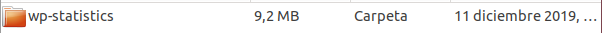
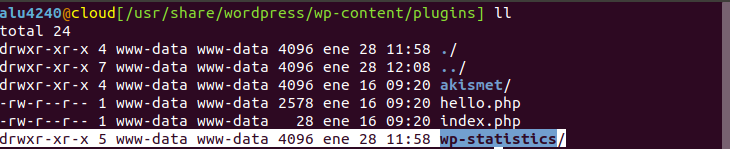
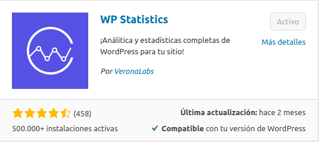
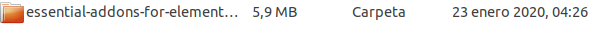
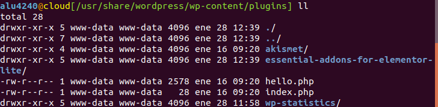
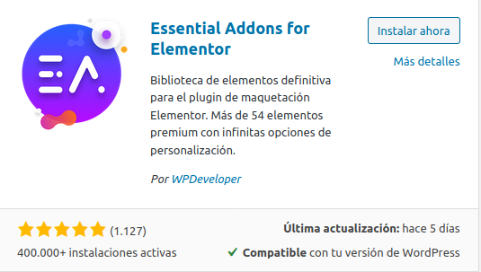
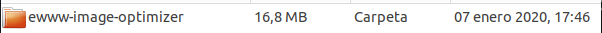
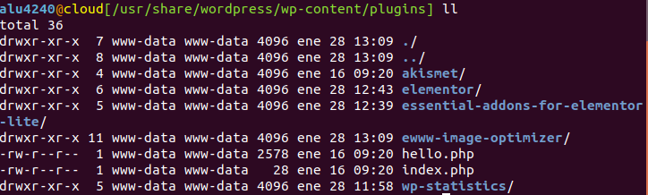
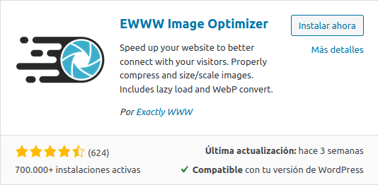

# UT5-A2: Plugins de WordPress

## WP Statistics
### Descripción
WP Statistics es una sencilla  herramienta que sirve, entre otras cosas para registrar los datos de los visitantes y los convierte en gráficos según su país de procedencia, ciudad, etc.

### Facilidad de instalación/activación
Es muy fácil de instalar, ya que solo tienes que descargar desde la página de WordPress.

Subir su contenido a "/wp-content/plugins/".

O ir directamente al menú de plugins en nuestra herramienta de Administrador de la página y buscarlo.

Para activarla solo tienes que ir al menú de plugins y pinchar en el botón de "Activar".

### Facilidad de uso
La herramienta es muy fácil de usar y muy intuitiva ya que puedes ver toda la información en una única página o si quieres ver algún apartado más concreto puedes hacerlo por separado.

### Tipo de páginas en las que sería útil
- Blogs.
- Noticias.

### Widgets asociados
Esta herramienta no contiene Widgets asociados.

### Requerimientos/Dependencias
- Necesita la versión de WordPress 3.0 o superior.
- Necesita la versión de PHP 5.6 o superior.

## Essential Addons for Elementor
### Descripción
Essential Addons for Elementor es una herramienta secundaria dentro del plugin Elementor que mejora la creación de páginas de dicho plugin.

### Facilidad de instalación/activación
Es muy fácil de instalar,como con el plugin anterior, solo tienes que descargar desde la página de WordPress.

Subir su contenido a "/wp-content/plugins/".

O ir directamente al menú de plugins en nuestra herramienta de Administrador de la página y buscarlo.

Para activarla solo tienes que ir al menú de plugins y pinchar en el botón de "Activar".

### Facilidad de uso
Es bastante fácil de utilizar ya que como es una herramienta de maquetado de páginas webs es todo visual.

### Tipo de páginas en las que sería útil
En cualquier tipo de página ya que esta herramienta lo que hace es ayudar a maquetar páginas o secciones de dichas páginas.

### Widgets asociados
La herramienta Essential Addons for Elementor trae más de 35 Widgets asociados, alguno de ellos son:
1. Post Grid.
2. Creative Buttons.
3. Fancy Text.
4. Countdown.
5. Team Members.

### Requerimientos/Dependencias
- Necesita la versión de WordPress 4.0 o superior.
- Necesita la versión de PHP 5.4 o superior.
- Necesita tener instalado y activado el plugin Elementor.

## EWWW Image Optimizer
### Descripción
EWWW Image Optimizer como su mismo nombre indica es un optimizador de imágenes, esta herramienta te hace ahorrar espacio, también puede hacer que mejore el posicionamiento de los motores de búsqueda.

### Facilidad de instalación/activación
Descargamos el plugin de la página web de WordPress

y la carpeta que hay dentro la movemos a "/wp-content/plugins".

También podemos hacerlo desde el menú de plugins de nuestra herramienta de Administrador de la página.

### Facilidad de uso
Bastante fácil de usar, ya que la optimización la hace automáticamente cuando subes cualquier imagen.

### Tipo de páginas en las que sería útil
Cualquier página, ya que practicamente todas las páginas suelen usar imágenes.

### Widgets asociados
Este plugin no trae ningún Widget asociado.

### Requerimientos/Dependencias
- Necesita la versión de WordPress 5.0 o superior.
- Necesita la versión de PHP 5.6 o superior.
